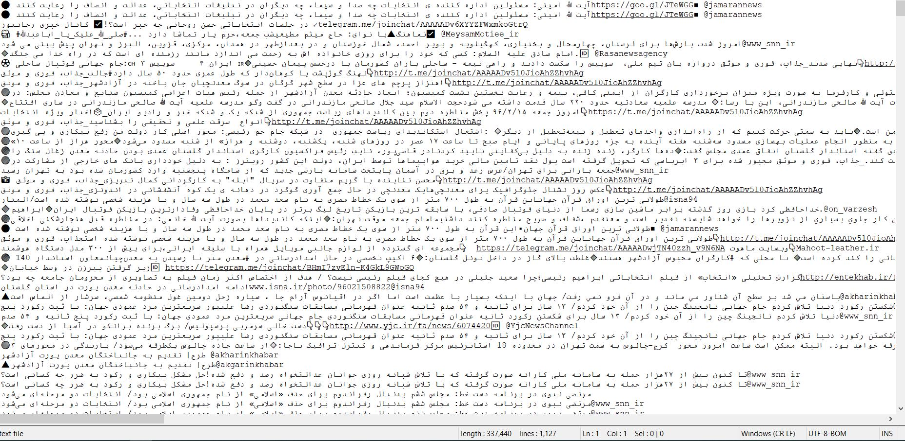
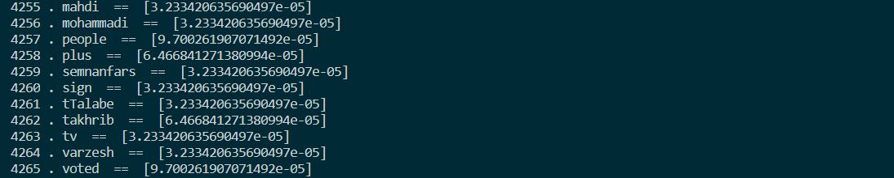
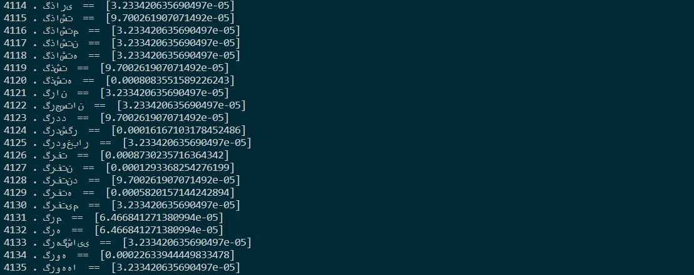
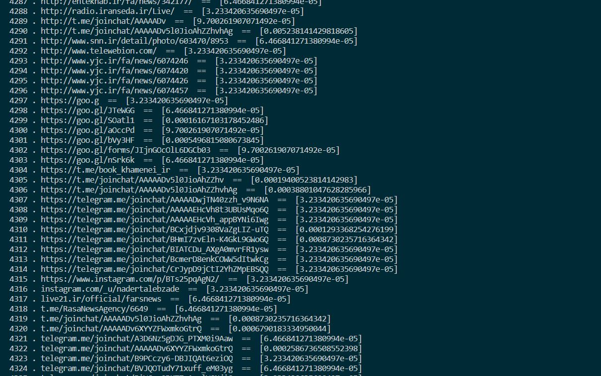

# Tokenizer with Tf and Idf Scores Calculation
```diff
+ Word(persian + english), Link, Number Tokenizer With TFIDF Scores Calculation
```
A project for tokenizign words(including Persian), links, numbers from texts and calculating the 'tfidf' values.</br>
Import your texts(yes it supports multy text files) by writing your texts allocated foldor address.</br>
In first step, this project tokenizes Persian and English words of the text.</br>
Then it tokenizes the links inside the texts and at the end it tokenizes the numbers inside the texts.</br>
(Also it normalizes the junk persian letters into normal mode)</br>
(All done by regular expression and just its not perfect and includes some missings but accuracy is over 98%)</br>
In second step,it sorts the tokens (i used bubble sort for persian words sorting, it was from O(n^2) so
i just used simple python sort and i will fix that in future developments).</br>
In third step, it calculates the 'tf' , 'idf' , and finally 'tf-idf' values of the words based on the input texts.</br></br>
This is an example of input text :</br>

</br></br>
This is an example of English words tokenized : </br>

</br></br>
This is an example of Persian words tokenized.
```diff
- My visual studio code doesnt supports Persian encode so the words showed reversed like this !
```

</br></br>
And finally this is an example of Links tokenized:</br></br>

